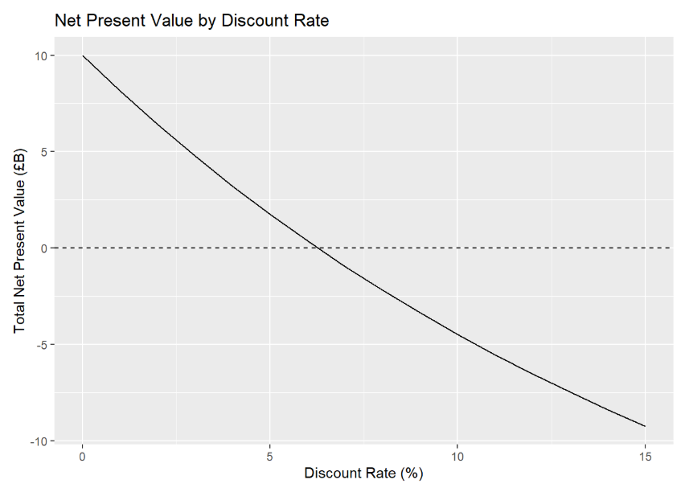
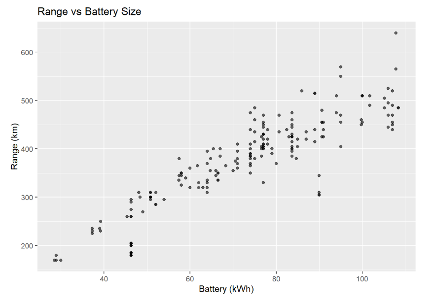

# Electric Vehicles & Cryptocurrency Analysis

This project refactors my undergraduate coursework (CST2330- Database Analysis for Enterprise Modelling) into a clean and reproducible data science project in R.
It combines finance, optimisation, exploratory data analysis, and time-series modelling.

---

## Live HTML report

📄 **Full report:**  
https://a6r9n.github.io/ev-crypto-analysis/ev_crypto_analysis.html

The report is generated from `analysis/ev_crypto_analysis.Rmd` and rendered via GitHub Pages.

---

## Project highlights

- **Net Present Value (NPV) modelling**
  
  - Five-year EV investment cashflows  
  - Custom `analyse_cashflow()` function to recompute NPV for any discount rate  
  - IRR estimation from an NPV–rate curve

- **Linear programming for production planning**  
  - Optimises daily mix of ICE, EV and hybrid vehicles  
  - Uses `lpSolve` to maximise profit under semiconductor, capacity and contract constraints  
  - Compares scenarios with different semiconductor supply limits

- **Electric vehicle dataset EDA**
   
  - Anonymised EV dataset (~200 vehicles)  
  - Relationships between battery size, range, performance and price  
  - “Which car is…?” queries for max range, efficiency, speed, acceleration and cheapest model

- **Cryptocurrency time-series processing**  
  - Converts raw OHLC candles into a **prices matrix** (one column per trading pair)  
  - Cleans missing values in a principled way (forward/backward fill)  
  - Computes **log-returns** and visualises price vs log-return behaviour for multiple pairs

All original coursework data has been **anonymised** before inclusion in this repository.

---

## Repository structure

```text
.
├── analysis/
│   └── ev_crypto_analysis.Rmd    # Main R Markdown report
│
├── data/
│   └── processed/
│       ├── ev-data-anon.csv      # Anonymised EV dataset
│       └── crypto-candles-anon.csv  # Anonymised crypto candles
│
├── docs/
│   ├── ev_crypto_analysis.html   # Knitted HTML report (served by GitHub Pages)
│   └── index.html                # Redirects root to the report
│
├── R/
│   ├── npv_functions.R           # NPV table builder and helper functions
│   ├── lp_models.R               # Linear programming models
│   ├── ev_eda.R                  # EV loading and summary helpers
│   └── crypto_processing.R       # Prices matrix + log-returns pipeline
│
└── README.md
